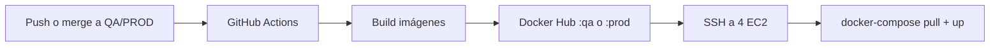

# Manual de despliegue — UCE Smart Parking (QA y PROD)

Guía para desplegar con **4 EC2 + Elastic IP**, **Terraform (estado local)** y **CI/CD** (GitHub Actions → Docker Hub → SSH).

> Infraestructura: `infra/terraform/` (no uses la carpeta `terraform/` de la raíz; es otro proyecto de ejemplo).

---

## Resumen del flujo



| Paso | Quién | Qué |
|------|--------|-----|
| 1 | Tú (una vez por lab) | `terraform apply` → 4 Elastic IP |
| 2 | Tú (una vez) | Copiar IPs y `.pem` a GitHub Environment |
| 3 | Tú / equipo | `push` o **merge PR** a `QA` o `PROD` |
| 4 | Actions | Build, tag `:qa` o `:prod`, deploy automático |

**No hay `git pull` en las EC2.** Solo se actualizan contenedores desde Docker Hub.

---

## QA vs PROD

| | **QA** | **PROD** |
|---|--------|----------|
| Rama Git | `QA` o `qa` | `PROD` o `prod` |
| Workflow | `.github/workflows/qa.yml` | `.github/workflows/prod.yml` |
| GitHub Environment | `qa` | `prod` |
| Tag Docker Hub | `:qa` | `:prod` |
| Terraform | `infra/terraform/environments/qa/` | `infra/terraform/environments/prod/` |
| Estado Terraform | `terraform.tfstate` **local** en esa carpeta | idem |
| `environment` en tfvars | `qa` | `prod` |

**Cambiar de laboratorio AWS:** solo exporta las credenciales del lab nuevo y haz `terraform apply` en la carpeta del ambiente. **No necesitas bucket S3** (estado local).

---

## Mapa Terraform → GitHub (nombres exactos)

Después de `terraform apply`, copia los outputs a GitHub.

### Environment `qa`

| Tipo en GitHub | Nombre exacto | Origen Terraform |
|----------------|---------------|------------------|
| Secret | `QA_EC2_SSH_KEY` | Contenido del `.pem` (no sale en terraform) |
| Secret | `QA_EC2_AUTH_HOST` | `auth_elastic_ip` |
| Secret | `QA_EC2_USER_HOST` | `user_elastic_ip` |
| Secret | `QA_EC2_VEHICLE_HOST` | `vehicle_elastic_ip` |
| Secret | `QA_EC2_FRONTEND_HOST` | `frontend_elastic_ip` |
| Secret | `DOCKERHUB_USERNAME` | Tu usuario Hub |
| Secret | `DOCKERHUB_TOKEN` | Token Hub |
| Variable | `QA_AUTH_API_URL` | `qa_auth_api_url` |
| Variable | `QA_USER_API_URL` | `qa_user_api_url` |
| Variable | `QA_VEHICLE_API_URL` | `qa_vehicle_api_url` |

### Environment `prod`

| Tipo | Nombre | Origen Terraform |
|------|--------|------------------|
| Secret | `PROD_EC2_SSH_KEY` | `.pem` |
| Secret | `PROD_EC2_AUTH_HOST` | `auth_elastic_ip` |
| Secret | `PROD_EC2_USER_HOST` | `user_elastic_ip` |
| Secret | `PROD_EC2_VEHICLE_HOST` | `vehicle_elastic_ip` |
| Secret | `PROD_EC2_FRONTEND_HOST` | `frontend_elastic_ip` |
| Secret | `DOCKERHUB_USERNAME` | Hub |
| Secret | `DOCKERHUB_TOKEN` | Hub |
| Variable | `PROD_AUTH_API_URL` | `prod_auth_api_url` |
| Variable | `PROD_USER_API_URL` | `prod_user_api_url` |
| Variable | `PROD_VEHICLE_API_URL` | `prod_vehicle_api_url` |

**Reglas:**

- Hosts EC2: **solo IP** (`54.1.2.3`), sin `http://`.
- API URLs: **con** `http://` y `/api` al final.
- `QA_EC2_SSH_KEY` / `PROD_EC2_SSH_KEY`: todo el archivo `.pem`.

### Ver resumen en terminal

```bash
chmod +x infra/scripts/print-github-setup.sh
./infra/scripts/print-github-setup.sh qa
# o
./infra/scripts/print-github-setup.sh prod
```

O:

```bash
cd infra/terraform/environments/qa
terraform output github_setup_summary
```

---

## Requisitos

- Terraform ≥ 1.5
- AWS CLI (verificar credenciales)
- Cuenta Docker Hub
- Repo en GitHub con `.github/workflows/qa.yml` y `prod.yml`

### Activar Actions

Repo → **Settings** → **Actions** → permitir workflows.

---

## Paso 1 — Credenciales AWS (cada sesión de lab)

```bash
# Copia los valores desde la consola del lab (Vocareum / AWS Academy). No los pegues en el repo.
export AWS_ACCESS_KEY_ID="TU_ACCESS_KEY_ID"
export AWS_SECRET_ACCESS_KEY="TU_SECRET_ACCESS_KEY"
export AWS_SESSION_TOKEN="TU_SESSION_TOKEN"   # obligatorio si el lab da sesión temporal (ASIA...)
export AWS_DEFAULT_REGION="us-east-1"

aws sts get-caller-identity
```

Si falla `InvalidClientTokenId`, renueva credenciales.

> **Error que viste en PROD:** `No valid credential sources found` = no exportaste credenciales **antes** de `terraform init/apply`.

---

## Paso 2 — Key pair (.pem)

1. EC2 → Key pairs → Create → descarga `.pem`
2. `chmod 400 tu.pem`
3. En `terraform.tfvars`: `key_name = "nombre-en-aws"` (sin `.pem`)
4. En GitHub: pega el contenido en `QA_EC2_SSH_KEY` o `PROD_EC2_SSH_KEY`

---

## Paso 3 — Terraform (sin backend S3)

**Ya no uses** `backend.hcl` ni `infra/terraform/bootstrap` para el flujo normal. El estado queda en `terraform.tfstate` dentro de `qa/` o `prod/`.

### Si antes usabas S3 y quieres migrar a local

```bash
cd infra/terraform/environments/prod   # o qa
rm -rf .terraform
terraform init                       # sin -backend-config
terraform apply -var-file=terraform.tfvars
```

### Primera vez en un ambiente

```bash
cd infra/terraform/environments/qa   # o prod

cp terraform.tfvars.example terraform.tfvars
# Editar: key_name, dockerhub_user, allowed_ssh_cidr, aws_region
```

Secretos JWT (no van en el archivo):

```bash
export TF_VAR_jwt_secret="$(openssl rand -base64 48)"
export TF_VAR_jwt_refresh_secret="$(openssl rand -base64 48)"
export TF_VAR_internal_service_key="$(openssl rand -base64 48)"
```

**Primer apply** (URLs temporales en tfvars):

```hcl
frontend_url     = "http://52.70.19.170:3002"
user_service_url = "http://0.0.0.0:3001"
cors_origins     = "http://52.70.19.170:3002"
environment      = "qa"    # o "prod"
```

```bash
terraform init
terraform apply -var-file=terraform.tfvars
```

Anota las 4 Elastic IP.

**Segundo apply** (URLs reales):

```hcl
frontend_url     = "http://<FRONTEND_EIP>:3002"
user_service_url = "http://<USER_EIP>:3001"
cors_origins     = "http://<FRONTEND_EIP>:3002,http://<AUTH_EIP>:3000,http://<USER_EIP>:3001,http://<VEHICLE_EIP>:3003"
```

```bash
terraform apply -var-file=terraform.tfvars
```

---

## Paso 4 — Configurar GitHub

1. **Settings** → **Environments** → crear `qa` y/o `prod`
2. Pegar secrets y variables según la tabla de arriba
3. Mismo `DOCKERHUB_USERNAME` / `DOCKERHUB_TOKEN` en ambos environments (o distintos si quieres)

---

## Paso 5 — CI/CD (push o merge)

### QA

```bash
git checkout QA
git push origin QA
```

O merge un Pull Request hacia `QA` (también dispara el workflow).

### PROD

```bash
git push origin PROD
```

### Qué hace Actions

1. **Build & Push:** `smartparking-auth:qa`, `:user`, `:vehicle`, `:frontend` (o `:prod`)
2. **Deploy:** SSH a cada EC2, parchea `CORS_ORIGINS` con `sudo`, `docker-compose pull`, reinicia servicio

Imágenes en Hub:

- `TU_USUARIO/smartparking-auth:qa`
- `TU_USUARIO/smartparking-auth:prod`
- (igual user, vehicle, frontend)

---

## Arquitectura EC2

| EC2 | Puerto | Servicio compose |
|-----|--------|------------------|
| auth | 3000 | `auth-service` (+ postgres, redis) |
| user | 3001 | `app` |
| vehicle | 3003 | `app` |
| frontend | 3002 | `app` |

En EC2 se usa el binario **`docker-compose`** (no `docker compose` plugin).

---

## Cambiar de laboratorio (checklist)

1. Credenciales AWS del **nuevo** lab (`aws sts get-caller-identity`)
2. (Opcional) `terraform destroy` en el lab viejo
3. En la carpeta `qa` o `prod`: `terraform init` + `apply` con tfvars del nuevo lab
4. Actualizar **solo** el GitHub Environment correspondiente con las **nuevas** EIP
5. `git push` a la rama correcta
6. No mezclar: EC2 de PROD deben usar imágenes `:prod`, QA las `:qa`

Cada carpeta (`qa/`, `prod/`) tiene su **propio** `terraform.tfstate` local.

---

## Errores frecuentes

| Error | Solución |
|-------|----------|
| `No valid credential sources found` | `export AWS_*` antes de terraform |
| `Backend initialization required` / S3 | Quitaste S3: `rm -rf .terraform` y `terraform init` sin backend.hcl |
| Workflow no aparece | Subir `.github/workflows/` desde la **raíz** del repo |
| `Missing QA_AUTH_API_URL` | Variables en GitHub Environment `qa` |
| CORS en navegador | Re-run deploy; CI parchea `CORS_ORIGINS` |
| `sed: Permission denied` | Corregido con `sudo` en workflow |
| `docker: compose is not a command` | Usar `docker-compose` en EC2 (ya en workflow) |
| Push de 648 MB | No subir `.terraform/` a Git |
| PROD usa imágenes QA | `environment = "prod"` en tfvars y push a `PROD` |
| `InvalidGroup.Duplicate` prod-*-sg | Recursos huérfanos en AWS sin estado local — ver sección abajo |

---

## Qué no subir a Git

- `**/.terraform/`
- `*.tfstate`, `*.pem`
- `terraform.tfvars` (usa `terraform.tfvars.example`)
- `smart-parking/.env`

---

## Error `InvalidGroup.Duplicate` (security group ya existe)

Pasa si hiciste un `apply` antes, luego borraste `terraform.tfstate` o `.terraform`, y volviste a aplicar: los **security groups** siguen en AWS pero Terraform no los conoce.

**Opción A — Solo volver a aplicar (recomendado tras actualizar el módulo)**

El módulo usa `name_prefix` y crea grupos con nombre único (`prod-auth-sg-xxxxx`):

```bash
cd infra/terraform/environments/prod
terraform apply -var-file=terraform.tfvars
```

Los `prod-auth-sg` viejos quedan huérfanos en la consola; puedes borrarlos manualmente si quieres.

**Opción B — Borrar huérfanos en AWS y aplicar de nuevo**

1. Consola EC2 → **Security groups** → elimina `prod-auth-sg`, `prod-user-sg`, `prod-vehicle-sg`, `prod-frontend-sg` (solo si **no** tienen instancias activas).
2. `terraform apply -var-file=terraform.tfvars`

**Opción C — Importar (si quieres reutilizar el mismo SG)**

```bash
# Obtén el sg-xxxxxxxx de la consola para cada uno
terraform import 'module.auth.aws_security_group.this' sg-xxxxxxxx
# Repite para user, vehicle, frontend
terraform apply -var-file=terraform.tfvars
```

> En tu último intento las **Elastic IP sí se crearon** y están en el estado. Un `terraform apply` siguiente debería crear instancias y asociar esas EIP.

---

## Destruir infraestructura

```bash
cd infra/terraform/environments/qa   # o prod
terraform destroy -var-file=terraform.tfvars
```

---

## Checklist rápido QA

- [ ] Credenciales AWS activas
- [ ] `terraform init` + `apply` en `environments/qa`
- [ ] Segundo apply con URLs reales
- [ ] `terraform output` → GitHub environment **qa**
- [ ] `.github/workflows/qa.yml` en el repo
- [ ] `git push origin QA` → Actions verde
- [ ] Abrir `http://<frontend_elastic_ip>:3002`

## Checklist PROD

- [ ] Mismo flujo en `environments/prod` con `environment = "prod"`
- [ ] GitHub environment **prod** con prefijo `PROD_*`
- [ ] `git push origin PROD`

---

## Archivos clave del repo

```
.github/workflows/
  qa.yml              # CI/CD rama QA, tag :qa
  prod.yml            # CI/CD rama PROD, tag :prod
infra/terraform/
  environments/qa/    # terraform.tfstate local
  environments/prod/
  modules/microservice-ec2/
infra/scripts/
  print-github-setup.sh
```
